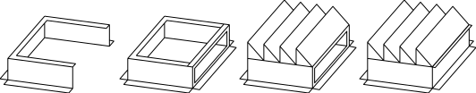
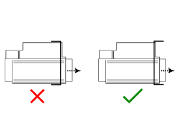

# Initial Setup Guide

## Receiving

!!! tip "Receiving the building"

    - Remove shipping protection from the outside of the building
    - Ensure there is nothing obstructing the exhaust dampers
    - Ensure the intakes can be opened
    - Ensure the filters are free of debris
    - Check for any damage to the exterior of the building

!!! tip "Placement Recommendations"

    - Orient the building parallel to prevailing wind directions for optimal performance.
    - Place the unit on piles or raised framework for improved cooling.
    - When placing multiple loadcenters near each other, keep at least 8–10ft between outside walls.

## Grounding

All loadcenters must be bonded to ground prior to operation, either:

- To an existing ground system on site, or
- a new ground which complies with the electrical code in your jurisdiction.

!!! danger
    Improper or missing grounding can result in **electrical issues, instability, and serious damage to components**.
    
    Failure to properly ground the loadcenter will void your warranty.
    

## Shrouds and recirculation

All modern loadcenters (V3 and newer) come with built-in foldable shrouds which are used to deflect heat away from the intakes,
and can be configured to recirculate heat during winter months.
These shrouds should be folded out, and screwed in place with Tek screws prior to operation.

!!! tip "Recirculation"
    In locations where recirculation will not be used, it is recommended to fully seal the moving sliders to prevent unwanted heat from re-entering the loadcenter.

??? info "Older loadcenters"
    On some older loadcenters, the shrouds come disassembled.
    Upon receiving them, they will need to be assembled, using Tek screws and an impact driver.
    
    !!! warning
        Remember to use gloves and PPE when working around sharp metal edges.

    To assemble them, follow this process:

    1. Lay the outer casing out flat, with the flanges for screwing facing down.
    2. Put the sliding heat recirculation holder in place inside of it.
        The slot for the heat recirculation slider should be just outside of the metal of the casing.
    3. Screw the casing and slider holder together to attach them.
    4. Add the deflectors, starting at the bottom. They should all face
        away from the slider. Screw these to the casing to secure them.

        !!! note
            Some building have 4 deflectors per shroud, other have 5.
            Split the deflectors up as needed to ensure each shroud has the same amount of deflectors.

    5. Insert the heat deflector slider.
 
        { .fix-png }
        /// caption
        Deflector Assembly Steps
        ///

    6. Attach the shrouds to the building, with the top shroud deflectors facing up, and the bottom deflectors facing down.

        { .fix-png width="20%" }
        /// caption
        Deflector Attachment Direction
        ///

## Installing Miners

Your loadcenter may come with laser cut inserts, depending on what type of miners you are using.

Miner types which need inserts:

- [x] Bitmain Antminer X19 series
- [ ] Bitmain Antminer X21 series
- [x] MicroBT Whatsminer
- [x] Canaan Avalonminer
- [x] Other (Contact Us)

Before installing miners, place the inserts into the shelves, with the metal flanges facing toward the outside of the building.

{ .fix-png width="50%" }
/// caption
Miner Inserts
///

!!! tip "Shelving Miners"
    1. Place the miner on the shelf.
    2. Slide the miner all the way to the back. The body of the miner should press against the insert, or the shelf lip (for X21 series miners).

### Filters

??? info "V1 models — Modular filter box"
    V1 models use a second interior stage of filtration with a modular filter box. On larger models, the individual filters will need to be installed into the modular boxes below each miner rack.

    1. Select the correct filter for conditions. **White filters** are used for winter conditions and help filter snow and ice. In summer months or hot climates, the **yellow fiberglass filters** should be used.
    2. Find the air flow arrows on the ends of the filters. When installed in a pair, the arrows should face outward.
    3. Slide the filters into the sheet metal brackets attached to the box.
    4. Seal between the filters with tape.

    [Contact us](contact.md) for replacement filters.

## LoadSync(tm) setup

LoadSync(tm) should be powered via a UPS, which is included inside the loadcenter. There are also cables included with the UPS to connect it to LoadSync(tm).

!!! tip "Connecting the UPS and LoadSync(tm)"
    1. Connect the supplied cords to the black `Battery Backup` sockets on the back of the UPS.
    2. Place the UPS either on the floor, or on the provided shelf (if applicable).
    3. Connect the other end of the cables to LoadSync(tm), one to the bottom of the panel, the other to the exposed cable end.

!!! warning "Rebooting LoadSync(tm)"
    Shutting off power to the unit **will not** properly reboot LoadSync(tm), as it runs off the UPS (Backup Battery). To correctly reboot LoadSync(tm), shut off the UPS or unplug all systems from the UPS for at least 10 seconds.

For software configuration and remote access, see the [LoadSync Guide](loadsync.md).

## Internet

The easiest way to connect internet to a loadcenter is with Starlink.

Internet is routed in via a port on the top of the LoadSync(tm) panel.

=== "Starlink"

    !!! tip "Connecting Internet"
        1. Use the provided adaptor cable to power the Starlink modem from the UPS.
        2. Run the ethernet cable from the Starlink modem to the input port on top of LoadSync(tm).
        3. Follow the [Starlink Setup Guide](https://starlink.com/support/article/412a70ca-0d9a-813e-b18f-75c36b84ec06?srsltid=AfmBOorJ5Xbz8_r2wmXyjL0yvitUe96tyCnqscM80Dncu6oDpyfQBAJI).

    !!! warning "Changing the Subnet"
        It is recommended that you change which subnet your Starlink modem is configured to.
    
        The default is `192.168.1.1/24`, which is very common in residential routers, and can cause overlaps.
        If the subnet in the loadcenter overlaps with your local subnet, some features of LoadSync(tm) (such as the Tailscale integration) may not work properly.

        See the corresponding [Starlink guide](https://starlink.com/support/article/5f5f34ab-2e08-7ce8-75cf-7460597c485c?srsltid=AfmBOorBoLGz3ePovEWVkdK29sqUwtk8VgfQXaH3I_4T8BDdWLI3rXvY).

        !!! warning
            After changing the subnet, you will need to power down and power up the loadcenter so that the miners and other IoT devices can fetch their updated IP's from the DHCP server.

=== "LTE Modem"

    !!! tip "Connecting Internet"
        1. Insert the SIM card into the modem in slot 1.
        2. Use the provided adaptor cable to power the LTE modem from the UPS.
        3. Run the ethernet cable from the LTE modem to the input port on top of LoadSync(tm).
        4. Connect the small end of the coax adaptor cable to the `main` port on the modem.
        5. Connect the large end of the coax adaptor cable to the lightning arrestor, mounted to the wall.
        6. Connect the large coax cable to the other end of the lightning arrestor.
        7. Route the large coax cable out of the building using the provided 1" nipple on the wall.
        8. Attach the other end of the large coax cable to the provided antenna.
        9. Mount the antenna on the mast, and mount the mast to the building.

        !!! tip "Antenna Mounting"
            You may need to connect the cable to the antenna before mounting it, depending on the height of the mast.

        For help with configuring the APN if needed, please [contact us](contact.md).
        
    !!! warning "Changing the Subnet"
        It is recommended that you change which subnet your LTE modem is configured to.

        The default is `192.168.1.1/24`, which is very common in residential routers, and can cause overlaps.
        If the subnet in the loadcenter overlaps with your local subnet, some features of LoadSync(tm) (such as the Tailscale integration) may not work properly.

        !!! warning
            After changing the subnet, you will need to power down and power up the loadcenter so that the miners and other IoT devices can fetch their updated IP's from the DHCP server.

=== "Other"

    !!! tip "Connecting Internet"
        1. If needed, use the provided adaptor cable to power your router from the UPS.
        2. Run the ethernet cable from the router to the input port on top of LoadSync(tm).

    !!! warning "Changing the Subnet"
        It is recommended that you change which subnet your router is configured to.

        The default is `192.168.1.1/24`, which is very common in residential routers, and can cause overlaps.
        If the subnet in the loadcenter overlaps with your local subnet, some features of LoadSync(tm) (such as the Tailscale integration) may not work properly.

        !!! warning
            After changing the subnet, you will need to power down and power up the loadcenter so that the miners and other IoT devices can fetch their updated IP's from the DHCP server.

## Startup

=== "Hash Huts"

    !!! warning "Prior to startup"
        
        Before progressing to the startup procedures:
            
        - Ensure all electrical connections have been completed properly.
        - Ensure the loadcenter has a neutral termination.
        - Ensure the neutral is bonded to ground upstream of the loadcenter.

        !!! danger
            
            Failing to terminate the neutral properly ***will*** damage many components of your loadcenter.
            Double check with your electrician that the neutral is connected properly and bonded to ground either in the generator or transformer.

    !!! tip "Startup"

        Ensure the main circuit breaker is off prior to startup.

        1. Turn on the PDU and auxiliary breakers, located inside the main panel at the rear of the building.
        2. Turn on the breakers on the inside of the LC panel(s), located inside the building.
        3. Turn on the breakers on the exterior of the LC panel(s).
        4. Turn on the main breaker on the exterior of the main panel at the rear of the building.

    !!! tip "Adding Load"

        1. Turn the breakers that control the PDUs (in the main distribution panel) to the on position.
        2. Turn any auxiliary breakers to the on position.
        3. If your distribution panel does not have an exterior handle, turn the main breaker in the bottom of the panel to the on position.
        If the panel does have a handle, close the door and move the handle to the on position.
        4. Continue downstream of the main breakers.
        5. **Make sure all fan switches located on the fan pods are turned on.**

        V2/V3 models come equipped with an auxiliary panel housing breakers for lights, receptacles, VFD, and IPC power. Turn the breakers on, close the door to the panel, and turn the main handle to the on position. All equipment inside the unit will now be live.

=== "Hash Generators"
    
    !!! warning "Prior to startup"

        Before progressing to the startup procedures:

        - Check for any loose or damaged components that may have occurred during shipping.
        - Uncap and assemble the exhaust.
        - Ensure that the correct size gas line is being used and has been inspected and approved for use.
        - Connect the gas line to the gas intake on the outside of the building.
        - Check that input pressure is correct (5PSI minimum to 25PSI maximum).
        - Ensure all manifolds are correctly set.
        - Check coolant levels and add 50/50 premix as required.
        - Check engine oil levels and add 15W-40 low ash oil if needed.
        - Ensure there is 6oz-8oz (8-12in W.C) after the regulator.
        - Purge the fuel line of any air.
        - Double check for any fuel leaks.
        - Open 1 1/4" or 2" gas valve at the rear of the engine.

    !!! tip "Startup"
        
        Ensure all electrical circuit breakers are in the off/open position.
        This includes breakers in auxiliary panels.

        === "Dynagen"
            
            1. Turn on the battery switch.
            2. Press the `Auto` button on the Dynagen controller.
            3. Press the `Start` button on the Dynagen controller.
            4. Allow the engine to warm up to operating temperature.
            5. Check fuel pressures to ensure stability.
            6. Once the engine is at operating temperature, it will ramp up to full RPM automatically.
            7. Check fuel pressures again to ensure stability at full RPM.
            8. Adjust household regulator if needed (any lower than 5 Oz will cause premature failure).

        === "DeepSea"

            1. Turn on the battery switch.
            2. Press the `Manual` button on the DeepSea controller.
            3. Press the `Start` button on the DeepSea controller.
            4. Allow the engine to warm up to operating temperature.
            5. Check fuel pressures to ensure stability.
            6. Once the engine is at operating temperature, it will ramp up to full RPM automatically, and the `Generator Ready` light will illuminate.
            7. Check fuel pressures again to ensure stability at full RPM.
            8. Adjust household regulator if needed (any lower than 5 Oz will cause premature failure).

    !!! tip "Adding Load"

        1. Turn the breakers that control the PDUs (in the main distribution panel) to the on position.
        2. Turn any auxiliary breakers to the on position.
        3. If your distribution panel does not have an exterior handle, turn the main breaker in the bottom of the panel to the on position. If the panel does have a handle, close the door and move the handle to the on position.
        4. Continue downstream of the main breakers.
        5. **Make sure all fan switches located on the fan pods are turned on.**

        V2/V3 models come equipped with an auxiliary panel housing breakers for lights, receptacles, VFD, and IPC power. Turn the breakers on, close the door to the panel, and turn the main handle to the on position. All equipment inside the unit will now be live.

    !!! info "Need assistance with startup?"
        If you would like an Upstream mechanic to help with the startup process over the phone, please [contact us](contact.md) to schedule on-call help.

## Contact Us

Get in contact with us using the info on the [`Contact Us`](contact.md) page

*[UPS]: Uninterruptible Power Supply