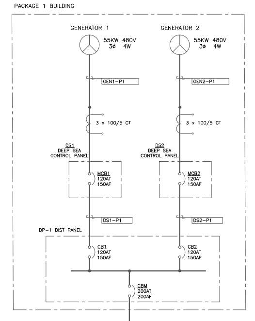
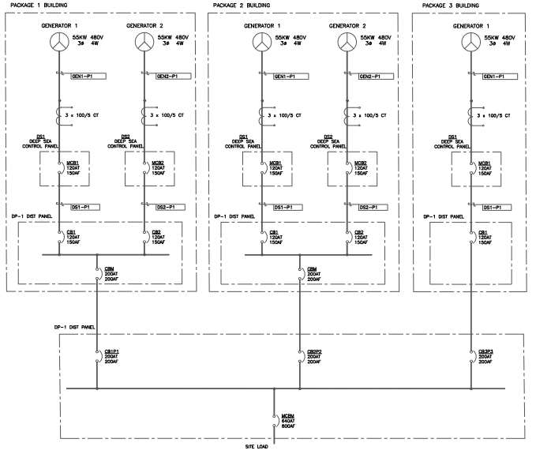

# Parallel Generator Units

This procedure covers safe startup, synchronization, loading, monitoring, and shutdown of parallel engine-generator packages.

!!! info "Applies to"
    - **Generator package:** 5.7 L / 55 kW, natural gas or propane
    - **Controller:** DSE 8610 Synchronizing Genset Controller
    - **Source procedure:** UDI-CDA-OPS-001, Revision 0, issued June 23, 2026

    Use the engineered drawings and approved site procedures for the installed equipment. Other engine, controller, fuel, or distribution configurations may require different limits and steps.

!!! danger "Mandatory stop rule"
    Confirm every indication and condition before continuing. If a value is missing, a display shows `XXXX`, an alarm is active, or a check cannot be confirmed, **stop immediately**. Investigate and correct the condition before proceeding.

## Safety and PPE

- Wear steel-toed safety boots, high-visibility clothing, and safety glasses.
- Wear Arc Flash PPE Level 2 when assembling in or testing the panel.
- Use heavy-duty gloves when handling panels, crating, or sharp components.
- Wear hearing protection when required by the job safety analysis or site safe-work practice.
- Use ESD grounding straps when handling exposed circuit boards or sensitive electrical components.
- Follow all site lockout/tagout requirements and job-specific safe work practices.

!!! warning
    Only trained and qualified personnel may operate, inspect, adjust, or repair this equipment. Contact Upstream Data before performing warranty repairs or if a fault cannot be resolved using this procedure.

## Pre-start inspection

- [x] Remove the exhaust cap and confirm the discharge path is clear.
- [x] Confirm the battery is connected.
- [x] Close the single-pole breaker inside the DSE 8610 panel.
- [x] Confirm the DSE display reads **Generator at Rest / Stop Mode**.
- [x] Scroll through the DSE parameter pages and confirm every screen displays live values.
- [x] With the engine stopped, check coolant at the reservoir or sight level and check engine oil with the dipstick.
- [x] Inspect for leaks, loose connections, damage, or other abnormalities.
- [x] Leak-check all fuel connections and confirm no gas odor or hiss is present.

## Fuel system

1. Identify the active fuel: **natural gas** or **propane (LPG)**.
2. Confirm the fuel-selection line-up is correct and all required fuel valves are open.
3. Verify the inlet and outlet conditions for the active fuel:

    - **Natural gas:** Pressure entering the low-pressure regulator must not exceed **20 PSI**. Its outlet should read **5 ounces (approximately 8.6 in. w.c.)** under normal no-load conditions.
    - **Propane:** Confirm the regulator staging is correct for LPG before proceeding.

4. Continue monitoring the regulator outlet setpoint through startup, running, and full-load operation.

## Electrical line-up

All non-motorized breakers between each generator and the common paralleling bus must remain closed during normal operation. Use only the load breaker to switch site load on or off.

!!! danger
    An incorrect breaker line-up can cause severe equipment damage, injury, or death. Do not continue until every breaker position is confirmed.

=== "One package"

    For one package containing two parallel generators:

    - [x] Confirm **CB1 (Gen1)** and **CB2 (Gen2)** are **closed**.
    - [x] Confirm the distribution-panel load breaker **CBM** is **open** and remains open throughout startup and synchronization.
    - [x] Confirm neither DSE 8610 displays an error or alarm.

    { .fix-png width="526" }
    /// caption
    Single package with two generators connected to a common distribution bus
    ///

=== "Multiple packages"

    For multiple two-generator packages, or a combination of single- and double-generator packages:

    - [x] At every package, confirm **CB1 (Gen1)** and **CB2 (Gen2)** are **closed**.
    - [x] Confirm each package main breaker **CBM**, if equipped, is **closed** throughout startup and synchronization.
    - [x] Confirm no DSE 8610 displays an error or alarm.
    - [x] Confirm all main-distribution input breakers (**CB1P1, CB2P2, ...**) are **closed**.
    - [x] Confirm the main-distribution load breaker **MCBM** is **open** and remains open throughout startup and synchronization.

    { .fix-png width="679" }
    /// caption
    Multiple generator packages connected to a common main distribution bus
    ///

### Controller communications

- [x] Confirm the MSC and CAN communication cables are connected to every generator control panel.
- [x] Confirm the panels form a daisy chain: each intermediate generator connects to the preceding and following generator.
- [x] Confirm **120-ohm termination resistors** are installed at the first and last generators in the communication chain.

## Start and warm up each engine

1. On the DSE 8610, press **Manual** (hand) mode.
2. Press the green **Start** button.
3. If necessary, throttle the fuel ball valve to control gas admission and prevent flooding.
4. Allow the engine to idle and complete its programmed temperature-based run-up to rated RPM.

!!! danger "Maximum three crank attempts"
    Do not override or re-crank the engine after three unsuccessful attempts. Stop and investigate the starting fault.

!!! warning "Check idle mode"
    If a warm engine does not ramp to rated RPM, confirm that idle mode has not been forced on. Holding the black DSE button enables or disables idle mode.

Before closing a motorized breaker, confirm:

- [x] Fuel-regulator outlet pressure remains at the active-fuel setpoint.
- [x] The LM500 sight globe remains within the green line.
- [x] The engine has reached rated RPM.
- [x] Generator voltage and frequency match the site nominal values.
- [x] Engine oil pressure is sufficient.
- [x] Engine temperature is normal. The DSE begins displaying temperature at **134°F**; normal operating temperature is **160°F–180°F**.

!!! note
    The LM500 sight globe confirms that the oil maintainer is holding level. It does not show the engine's actual oil level; verify actual level with the dipstick only while the engine is stopped.

## Bring generators online

### First generator: dead-bus close

The first generator energizes the dead parallel bus.

1. At rated RPM, confirm the green **Generator Available** indication appears on the DSE source symbol.
2. Press the breaker **Close** button.
3. Confirm the second green indication appears, showing that the motorized breaker is closed.

!!! danger
    Closing the first motorized breaker energizes the parallel bus and the line side of the main load breaker. An open main breaker does **not** make this section dead.

### Additional generators: synchronized close

For each additional generator:

1. Complete the pre-start, line-up, startup, and warm-up checks above.
2. Confirm the DSE 8610 indicates that the generator is synchronizing to the live bus by matching voltage, frequency, and phase.
3. Confirm the green **Generator Available** indication appears.
4. Allow or command the synchronized close of the generator's motorized breaker.
5. Confirm load shares correctly across the online generators before starting the next generator.

!!! danger
    The first generator closes onto a dead bus. Every subsequent generator must close in synchronization with the live bus. Never force an out-of-sync breaker closed. If a generator will not synchronize or its breaker will not close, stop and investigate.

## Apply and monitor load

After all required generators are at rated RPM with their motorized breakers closed and synchronized, close the main load breaker to energize the downstream load.

While under load:

- [x] Maintain the correct fuel-regulator outlet pressure.
- [x] Confirm the LM500 sight globe remains within the green line.
- [x] Monitor all engine-generator parameters on each DSE 8610.
- [x] Confirm load remains correctly balanced across the generators.

## Normal shutdown

!!! warning
    Remove load before opening generator breakers, and open generator breakers before stopping engines. Never stop an engine while it is carrying load.

1. Open the main load breaker to disconnect downstream load.
2. On every DSE 8610, press the breaker **Open** button and confirm its motorized breaker opens.
3. Run the unloaded engines at rated RPM for **one to two minutes** to cool down.
4. Press the red **Stop** button on each DSE 8610.
5. Confirm every controller returns to **Generator at Rest / Stop Mode**.
